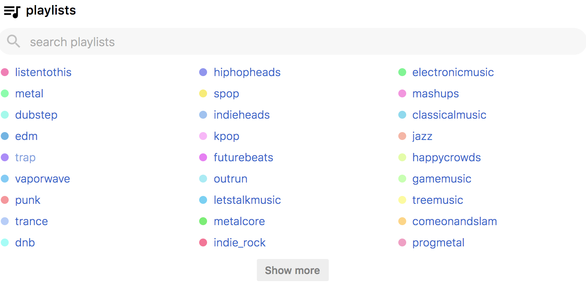

# rtunes

#### develop
* for web and desktop app: `npm install`
* fetch reddit data: `npm run prebuild`
* for mobile apps: `cd mobile && npm install`
* develop web app: `npm run dev`
* develop android: `npm run android`
* develop ios: `npm run ios`
* clean: `npm run clean`

#### build
* build web distribution (in `dist/` folder): `npm run build`
* run built web app: `npm start`
* build android app: `npm run android-release` 

*Note: android app must be signed and needs a keystore to be generated see [link](https://facebook.github.io/react-native/docs/signed-apk-android.html). You may need to uninstall the debug app version from the device.*

